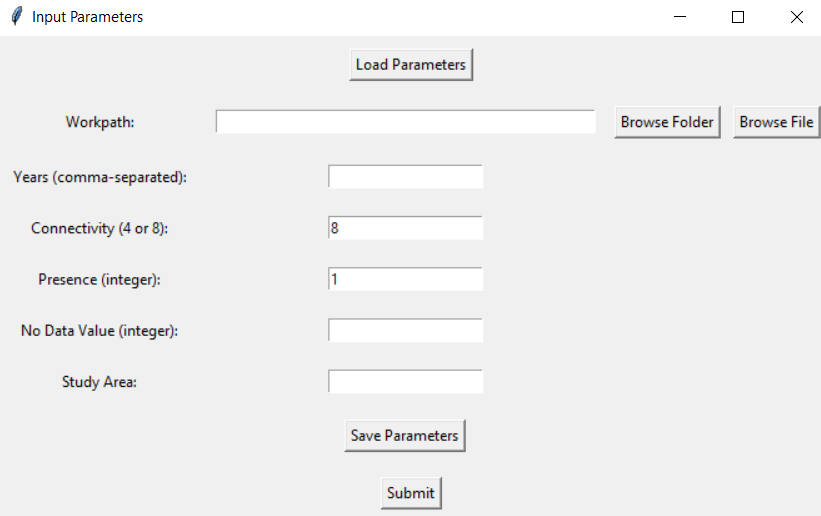
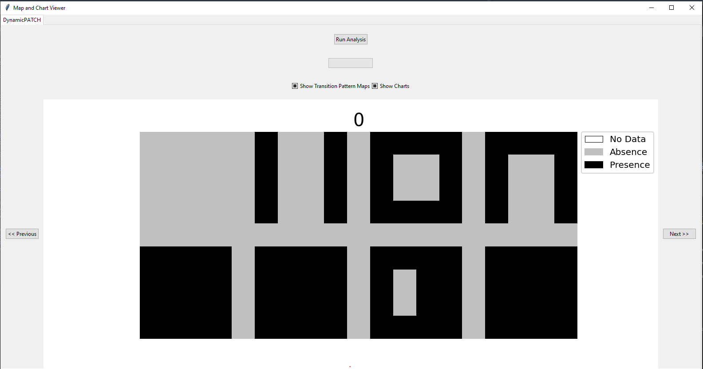
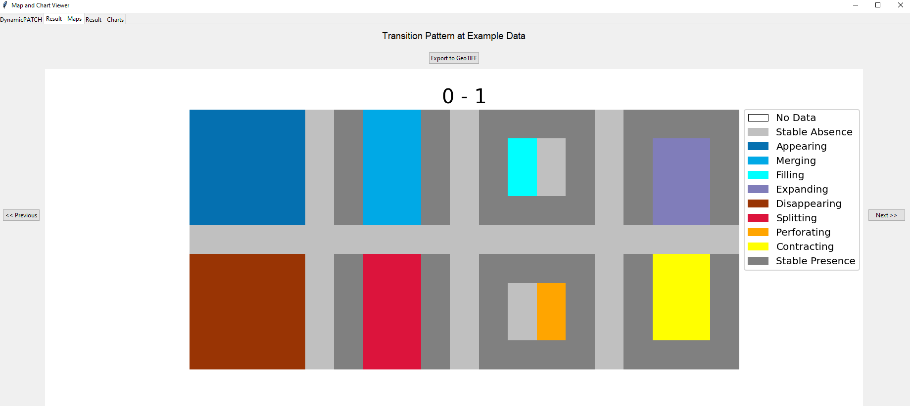

# DynamicPATCH

A Python package for Dynamic PAtch Transition CHaracterization in explicit space (DynamicPATCH)
================================================================================================
DynamicPATCH is a patch-based method that characterizes and quantifies eight types of mutually exclusive and collectively exaustive transition patterns: Appearing, Disappearing, Merging, Splitting, Filling, Perforating, Expanding, and Contracting. DynamicPATCH also computes gross changes in both area and number of patches. See more details about our method in our upcoming manuscript: Zhang et al. (2024) 

# 1. Installation 
----------------------
### Preparation
Before installing the package. Make sure you have Python (3.10 and or above) and pip installed. 

While installing DynamicPATCH will install most of the dependencies, the gdal package need to be installed separately. We recommend installing gdal using conda through the conda-forge channel with the following command:
```
conda install -c conda-forge gdal
```

### Install DynamicPATCH
Install the package using the following command:
```
pip install git+https://github.com/zay1996/DynamicPATCH.git
```


# 2. Running the package 
-----------------------
DynamicPATCH provides two ways to run the analysis: the graphical user interface (GUI) option and the command-line option. For ease of use with no coding requirement, use the GUI option. For more flexibility and greater control of the outputs, use the command-line option. Both options require use of a Python interpreter. 

## 2.1 Option one: using the built-in interface
Open `test-interface.py` from the `tests` folder, run the entire script with a Python interpreter. Enter parameters at the pop-up window:



you can save your parameters into a .txt file by clicking on the `Save Parameters` button. Click on `Submit` to upload the parameters. A new window will pop-up:



This interface visualizes your input data for each time point. For a test run, use the provided example data under the `exampledata` folder. Click on `Next>>` or `<<Previous` to navigate across maps at different time points. 

Before running the analysis, check what outputs are needed for your analysis, there are two output options: Show Transition Pattern Maps or Show Charts. Choose at least one option. The default will generates both maps and graphical outputs. 

Click on `Run Analysis` and wait until the analysis finishes. The results will be displayed in new tab(s):



## 2.2 Option two: command line  
The interface option offers a simple and straightforward way to run DynamicPATCH. However, calling the functions yourself in a Python script or using a command-line interface offers greater flexibility. The script 'test-command.py` gives an example of running DynamicPATCH in a script:

```
from dynamicpatch import main
## specify the parameters 
main.run_dynamicpatch(
        workpath = "DynamicPATCH/exampledata/example.xlsx",
        year = [0,
                1
    ],
        in_nodata = -1, # optional, default = 0
        connectivity = 8, # optional, default = 8
        targ_pre = 1, # optional, default = 1
        study_area = None, # optional, default = None
        map_show = True, # optional, default = True
        chart_show = True, # optional, default = True 
        unit = None, # let program decide automatically
        log_scale = True, # optional
        export_map = False, # optional, default = True
        width = 0.35 # optional, default = 0.35
    )
```

Note: due to an issue with the current version. Please restart the kernel when changing the input dataset and parameters to avoid errors. 


## Citation
Please cite our upcoming publication if you are using DynamicPATCH for your research. 
