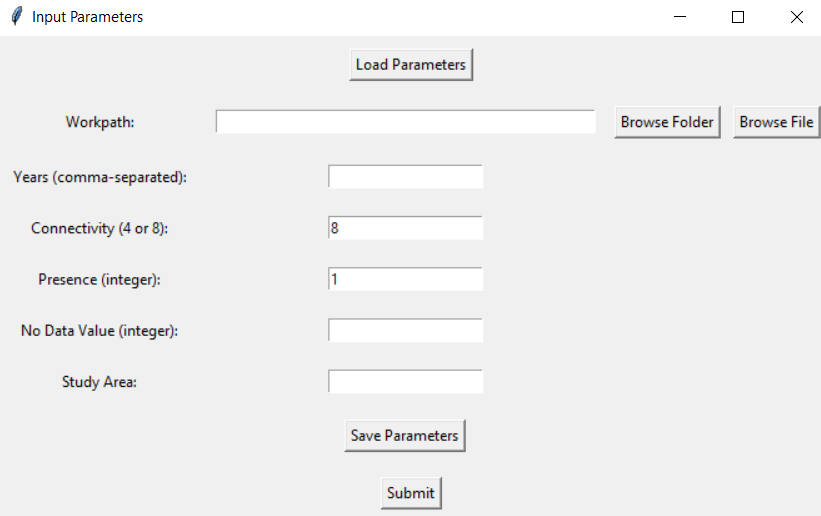

# DynamicPATCH

A Python package for Dynamic PAtch Transition CHaracterization in explicit space (DynamicPATCH)
================================================================================================
DynamicPATCH is a patch-based method that characterizes and quantifies eight types of mutually exclusive and collectively exaustive transition patterns: Appearing, Disappearing, Merging, Splitting, Filling, Perforating, Expanding, and Contracting. DynamicPATCH also computes gross changes in both area and number of patches. See more details about our method in our upcoming manuscript: Zhang et al. (2024) 

# 1. Installation 
----------------------
### Preparation
Before installing the package. Make sure you have Python (3.10 and or above) and pip installed. 

While installing DynamicPATCH will install most of the dependencies, the gdal package need to be installed separately. We recommend installing gdal using conda through the conda-forge channel with the following command:
```
conda install -c conda-forge gdal
```

### Install DynamicPATCH
Install the package using the following command:
```
pip install git+https://github.com/zay1996/DynamicPATCH.git
```


# 2. Running the package 
-----------------------
DynamicPATCH provides two ways to run the analysis: the graphical user interface (GUI) option and the command-line option. For ease of use with no coding requirement, use the GUI option. For more flexibility and greater control of the outputs, use the command-line option. 

## 2.1 option one: using the built-in interface
Open `test-interface.py` from the `tests` folder, run the entire script. Enter parameters at the pop-up window:



you can save your parameters into a .txt file by clicking on the `Save Parameters` button. Click on `Submit` to upload the parameters. A new window will pop-up:


## 2.2 option two: command line  


